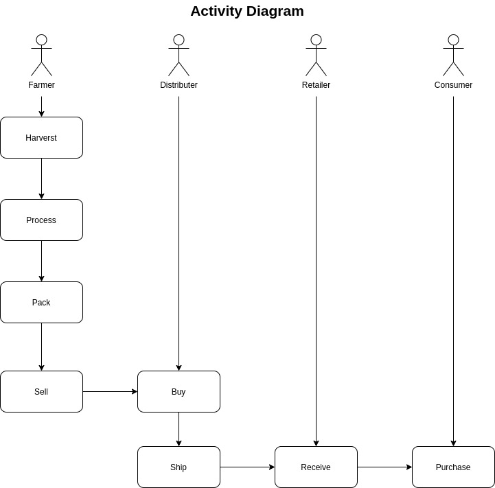
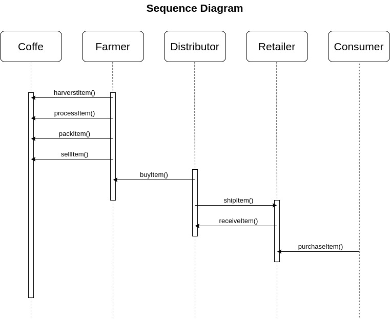
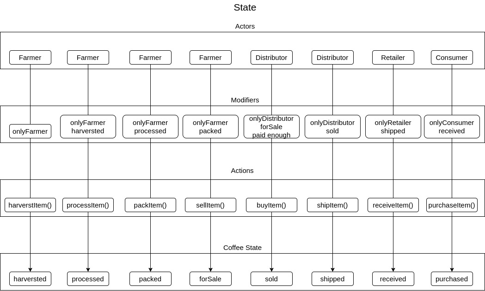
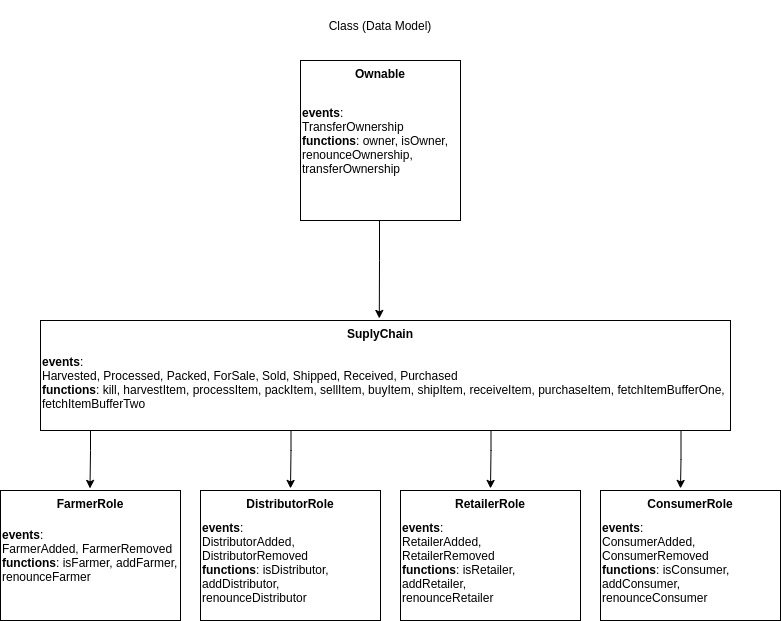
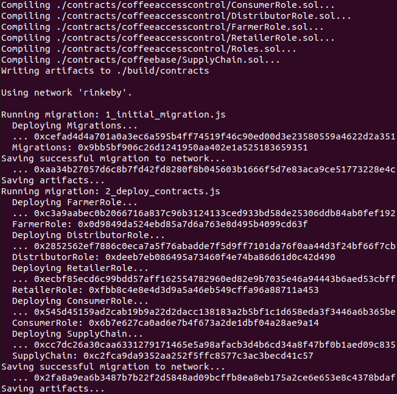

# Blockchain Developer Nanodregree (Supply chain project)

This project implements a Dapp (Decentralized Application) to control a supply chain flow over an Ethereum Smart Contract.

# Project write-up - UML





# Project write-up - Libraries
Roles library- Library for managing addresses assigned to a Role.
truffle-hdwallet-provider- Used to set up the provider to connect to the Infura Node

# Project write-up - IPFS
IPFS not used.

# Program version number
Node v14.18.0 \
Truffle v4.1.14 (core: 4.1.14) \
Solidity v0.4.24 (solc-js)
web3- minified lib inside src folder

# Smart Contracts Deployment


https://rinkeby.etherscan.io/address/0xc2fca9da9352aa252f5ffc8577c3ac3becd41c57

# Transaction History executed from frontend
harvestItem: 0x8f8fb1dfbd83df2994c0006cf62894cc734edff090dfe59f033e5bfdcbd33b20 \
processItem: 0x6afc3d9f0837b02872f1d5b9c09ed4ab854afd31c3573666b7c8d0f5c41aeeb4 \
packItem: 0x89b25606dc6af089477ec4f543394c9e8e084360da225110d8bcd82ccc5080d8 \
sellItem: 0xfae7734696ee74ea5304fe48fc5a046ccee8003a96246e3377ef76dd37cc6000 \
buyItem: 0x950d3f8db5056bfc7301e54baf0c77a2154ccb5abc7bf95182139171d7c23103 \
shipItem: 0x130112c85f38c1c42299bdfeb0d9e8b8e9c0c999eee7b53e4e4fa6c572c327b6 \
receiveItem: 0xb087510ffada4db60035cda516fae94a3747004b1aa236c1c2e996e8dc89bf28 \
purchaseItem: 0xe01ac3b1fc188a6a7b4186641fda2379ccba9335ad6287fbbfb81b49b279d794

# Summary

This repository containts an Ethereum DApp that demonstrates a Supply Chain flow between a Seller and Buyer. The user story is similar to any commonly used supply chain process. A Seller can add items to the inventory system stored in the blockchain. A Buyer can purchase such items from the inventory system. Additionally a Seller can mark an item as Shipped, and similarly a Buyer can mark an item as Received.

The DApp User Interface when running should look like...


## Getting Started

These instructions will get you a copy of the project up and running on your local machine for development and testing purposes. See deployment for notes on how to deploy the project on a live system.

### Prerequisites

Please make sure you've already installed ganache-cli, Truffle and enabled MetaMask extension in your browser.


### Installing

> The starter code is written for **Solidity v0.4.24**. At the time of writing, the current Truffle v5 comes with Solidity v0.5 that requires function *mutability* and *visibility* to be specified (please refer to Solidity [documentation](https://docs.soliditylang.org/en/v0.5.0/050-breaking-changes.html) for more details). To use this starter code, please run `npm i -g truffle@4.1.14` to install Truffle v4 with Solidity v0.4.24. 

A step by step series of examples that tell you have to get a development env running

Clone this repository:

```
git clone https://github.com/udacity/nd1309/tree/master/course-5/project-6
```

Change directory to ```project-6``` folder and install all requisite npm packages (as listed in ```package.json```):

```
cd project-6
npm install
```

Launch Ganache:

```
ganache-cli -m "spirit supply whale amount human item harsh scare congress discover talent hamster"
```

Your terminal should look something like this:


In a separate terminal window, Compile smart contracts:

```
truffle compile
```

Your terminal should look something like this:


This will create the smart contract artifacts in folder ```build\contracts```.

Migrate smart contracts to the locally running blockchain, ganache-cli:

```
truffle migrate
```

Your terminal should look something like this:


Test smart contracts:

```
truffle test
```

All 10 tests should pass.


In a separate terminal window, launch the DApp:

```
npm run dev
```

## Built With

* [Ethereum](https://www.ethereum.org/) - Ethereum is a decentralized platform that runs smart contracts
* [IPFS](https://ipfs.io/) - IPFS is the Distributed Web | A peer-to-peer hypermedia protocol
to make the web faster, safer, and more open.
* [Truffle Framework](http://truffleframework.com/) - Truffle is the most popular development framework for Ethereum with a mission to make your life a whole lot easier.


## Authors

See also the list of [contributors](https://github.com/your/project/contributors.md) who participated in this project.

## Acknowledgments

* Solidity
* Ganache-cli
* Truffle
* IPFS
